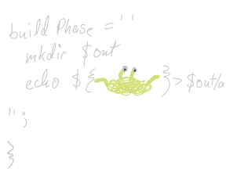
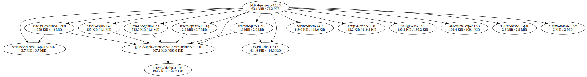
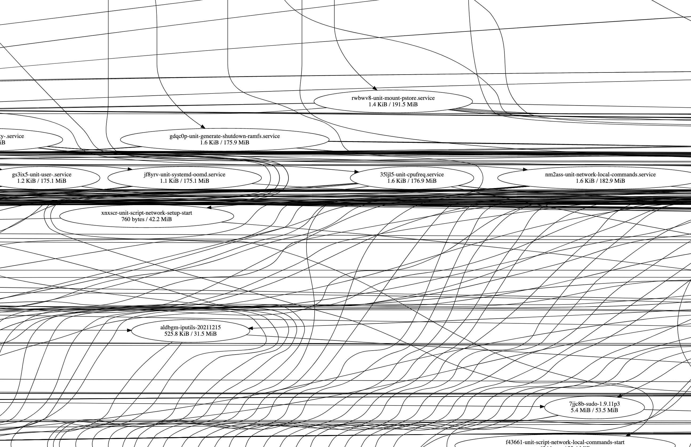
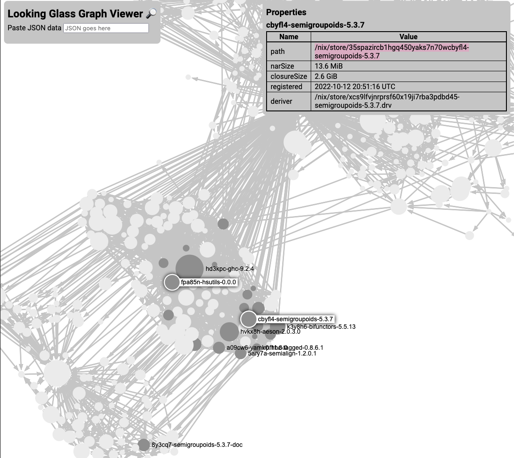
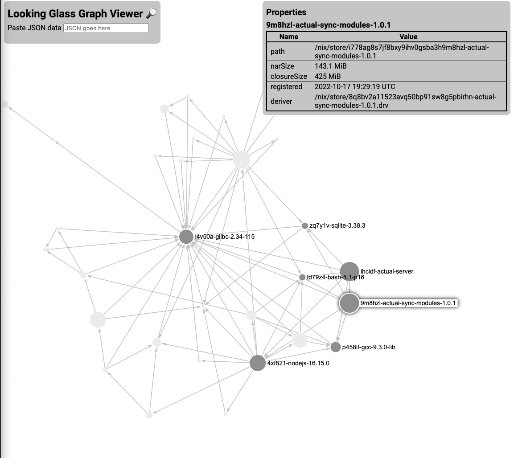

+++
title = "NixCon 2022: Debugging Closure Sizes Graphically with nix-closure-graph"
path = "/nixcon2022"
draft = false
tags = ["nix", "haskell", "nixcon", "javascript"]
date = "2022-10-20"
+++

I delivered a talk "Debugging Closure Size Graphically" at NixCon 2022. This
blog post is intended as a textual version of the talk although it is not a
script.

Here are links to the live version:

* [Livestream video][livestream] (a better recording with slides is coming soon)
* [Slides]
* Tools:
    * nix-closure-graph: https://github.com/lf-/dotfiles/tree/main/programs/nix-closure-graph
    * Graph viewer: https://mercurytechnologies.github.io/looking-glass-viewer/

[nix-closure-graph]: https://github.com/lf-/dotfiles/tree/main/programs/nix-closure-graph
[looking-glass]: https://mercurytechnologies.github.io/looking-glass-viewer/
[looking-glass-github]: https://github.com/MercuryTechnologies/looking-glass-viewer
[livestream]: https://youtu.be/l70haNBm1wc?t=4h34m10s
[Slides]: https://jade.fyi/nixcon2022/slides

## Closure size

Nix's smallest unit of building is a so-called "derivation". Generally there is
one of these per package or per part of a NixOS system. The derivation is a
concept at the layer of the Nix store.

Xe has said that [Nix is a compiler from Haskell to Bash][xe-why], which is a
quite good if flippant explanation of how the Nix language relates to the build
system: the "haskell" part is the Nix language, and the "bash" is the full
invocation of some builder (typically written in bash) to actually build the
thing, produced by `builtins.derivation`.

You can see the content of a derivation created by a Nix expression like so:



```json
 » nix show-derivation nixpkgs#hello
{
  "/nix/store/vdqm71n5bkfydjwjwmx2rkj18jrpxlmx-hello-2.12.1.drv": {
    "outputs": {
      "out": {
        "path": "/nix/store/m2wybrc3grfn76hxcv4gyiyncng17z30-hello-2.12.1"
      }
    },
    "inputSrcs": [
      "/nix/store/9krlzvny65gdc8s7kpb6lkx8cd02c25b-default-builder.sh"
    ],
    "inputDrvs": {
      "/nix/store/004b0bvpjng4l23kahn6vzawlpr6dx75-bash-5.1-p16.drv": [
        "out"
      ],
      "/nix/store/gajvqygc937wsfjdkpfpqrrk3mlpyy6z-stdenv-linux.drv": [
        "out"
      ],
      "/nix/store/j80mkmlf7xv7cqn3chh7ghi1r96406m2-hello-2.12.1.tar.gz.drv": [
        "out"
      ]
    },
    "system": "x86_64-linux",
    "builder": "/nix/store/dd3713mm8wql4r2d5jxx0f58g16nfm4h-bash-5.1-p16/bin/bash",
    "args": [
      "-e",
      "/nix/store/9krlzvny65gdc8s7kpb6lkx8cd02c25b-default-builder.sh"
    ],
    "env": {
      "buildInputs": "",
      "builder": "/nix/store/dd3713mm8wql4r2d5jxx0f58g16nfm4h-bash-5.1-p16/bin/bash",
      "cmakeFlags": "",
      "configureFlags": "",
      "depsBuildBuild": "",
      "depsBuildBuildPropagated": "",
      "depsBuildTarget": "",
      "depsBuildTargetPropagated": "",
      "depsHostHost": "",
      "depsHostHostPropagated": "",
      "depsTargetTarget": "",
      "depsTargetTargetPropagated": "",
      "doCheck": "1",
      "doInstallCheck": "",
      "mesonFlags": "",
      "name": "hello-2.12.1",
      "nativeBuildInputs": "",
      "out": "/nix/store/m2wybrc3grfn76hxcv4gyiyncng17z30-hello-2.12.1",
      "outputs": "out",
      "patches": "",
      "pname": "hello",
      "propagatedBuildInputs": "",
      "propagatedNativeBuildInputs": "",
      "src": "/nix/store/pa10z4ngm0g83kx9mssrqzz30s84vq7k-hello-2.12.1.tar.gz",
      "stdenv": "/nix/store/vsw40d3nb6mpjf770iv58czisf65lzzl-stdenv-linux",
      "strictDeps": "",
      "system": "x86_64-linux",
      "version": "2.12.1"
    }
  }
}
```



[xe-why]: https://twitter.com/leftpaddotpy/status/1578914185857372165

The "closure" of some Nix store path, for instance, of the "out" output of the
"hello" derivation above, refers to all the store paths referenced in that
store path, and the store paths referenced in such references recursively. If
you would like a mathy definition, see [Eelco's PhD thesis][phd-thesis], page
96.

[phd-thesis]: https://edolstra.github.io/pubs/phd-thesis.pdf

Put another way, the closure is "your thing and everything it depends on,
recursively".

The way that runtime dependencies are created in Nix is that Nix will
effectively `grep` for the hash part of any inputs of a derivation, which will
form the runtime dependencies.

This is unlike most other systems, which require explicit specification of
runtime dependencies, potentially allowing forgetting some (which will work on
the maintainer's machine that has the software but not on a fresh install). Nix
has the opposite problem: it's easy to accidentally *create* runtime
dependencies, since any reference to the build inputs in the outputs can create
one.

Closure sizes *largely* don't matter if you are building on the same system
that you are running the software on, besides leaving some stuff around that
the garbage collector can't delete due to pointless references. However, the
entire closure needs to be shipped around whenever you are deploying Nix-built
software to another machine, using up space (prod generally has less space than
your laptop!) and bandwidth.

### spaghetti monsters

Let the spaghetti monster be a stand-in for your choice of large thing; perhaps
a compiler, a build system, some interpreter you don't actually need at
runtime, or anything else.

If the spaghetti monster is in `buildInputs` of your derivation:


... *and* its store path appears in the output:



then the derivation will depend on the spaghetti monster at runtime, and thus
you will be transporting a big spaghetti monster along with your software,
anywhere it goes (such as in a Docker image or a NixOS deployment):


## Figuring out what your software depends on

You can use `nix path-info` to list the dependencies of a store path
`-r`ecursively, with `-s`izes, and closure `-S`izes, in `-h`uman readable form.

```text
~ » nix path-info -rsSh nixpkgs#hello
/nix/store/c8aj6kzv5h7c5vympiy7l1p3aw626yqy-libobjc-11.0.0                               199.7K  199.7K
/nix/store/y5cp9q9h6p80mzbsijs00zxpi7g0lc9d-apple-framework-CoreFoundation-11.0.0        667.1K  866.8K
/nix/store/xbqj64vdr3z13nlf8cvl1lf5lxa16mha-hello-2.12.1                                 126.9K  993.7K
```

This is, however, unhelpful, since this is actually structurally a graph, and
this view does not make it obvious what depends on what.

Nix actually can output GraphViz with `nix-store --query --graph` but it
doesn't show sizes so it is unhelpful.

### Just render a graph then!

I wrote a program in `jq`, everyone's favourite [language that, like Nix, is
also allegedly Haskell][xe-why], which generates GraphViz with good quality
output. It can be invoked with [`nix-closure-graph nixpkgs#python3 >
img.svg`][nix-closure-graph].

This works pretty well for Python (open the image in a new tab if you want to
look at it more closely):



But not so for NixOS closures:




### Just render a graph, but not with GraphViz

Writing a better graph viewer sounds hard, but it turns out
[Sigma.js](https://www.sigmajs.org/) already did the hard part of writing a
graph renderer that does well with big graphs, and I had already built a
Sigma-based graph viewer as a prototype at work as part of my internship
project.

I believe that it's not practical to show large graphs non-interactively: since
GraphViz contains the results of several papers on graph layout and it is slow
while also having poor output for large graphs, it follows that the only
practical option is to do something worse and faster for layout and make up for
it with interactivity. Sigma seems to be one of the better options for building
a viewer that does that.

[Looking Glass][looking-glass], my graph viewer, consists of a simple JSON
format (intended to be simple enough you can generate it directly out of
PostgreSQL) and a properties panel to list arbitrary data of nodes.

It's [open source][looking-glass-github] under the MIT license, if you want to
hack on it.



To use it, you can do a command like `nix-closure-graph --lg nixpkgs#python3 |
xsel -b` (pick your store path and clipboard tool of choice), then paste the
JSON into the box in the viewer.

[Here is the JSON from my NixOS closure, for example](./slides/graphs/nixos.json)

#### Why is GHC in my NixOS closure?

This is possibly a known issue, or possibly fixed in newer GHC, or possibly me
forgetting to use `pkgs.haskell.lib.justStaticExecutables`. Regardless, it's
not on purpose.

## Practical closure size problems

I was packaging [actual-budget], a budgeting program, to run it on fly.io. So I
figured out how to build a docker image for it with Nix. You can get the
[final version here](https://github.com/lf-/actual-server/tree/flake).

[actual-budget]: https://actualbudget.com/

However, I had a problem:

```text
 » ls -lah $(readlink result)
-r--r--r-- 1 root root 219M Dec 31  1969 /nix/store/6r0nslg23w2sa6a2zril3g0fvd6mnp1q-actual-server.tar.gz
```

200MB compressed is not good. It's just some JavaScript, what happened there?



It appears that for some reason `actual-server` and `actual-server-modules` are
both there, which is not quite right.

Also, it appears that Python got in there somehow, which is not necessary:


### What went wrong?

Python is in there because of an exceedingly poorly named legacy build system
inherited from Chromium called "Generate Your Projects", which compiles weird
Python into Makefiles.

Unfortunately Actual uses some native extensions, but *after* building those
with "Generate Your Projects", there's no reason at all to have Python around.

It turns out, nixpkgs ships a version of NodeJS that does not include Python
or npm, called [`nodejs-slim`][nodejs-slim].

[nodejs-slim]: https://github.com/nixos/nixpkgs/blob/4567b99d17d3e0f96e0022c18f92a08a03e91f3e/pkgs/top-level/all-packages.nix#L8586-L8588

The app is there twice because of a symlink:

```text
» nix why-depends -a --precise \
    /nix/store/qq1zblyp6ysx-actual-server \
    /nix/store/i778ag8s7jf8-actual-sync-modules-1.0.1

/nix/store/qq1zblyp6ysx96vd8havhw0wcsihcidf-actual-server
└───libexec/actual-sync/deps/actual-sync/node_modules
        -> /nix/store/i778ag8s7jf8b-actual-sync-mo>
    → /nix/store/i778ag8s7jf8-actual-sync-modules-1.0.1
```

However, if we look at what's actually in that symlink, we will find nothing
necessary at all.

```text
» ls -a result/libexec/actual-sync/deps/actual-sync/node_modules
.  ..  .bin
 » ls -a result/libexec/actual-sync/deps/actual-sync/node_modules/.bin
.  ..  eslint  prettier  tsc  tsserver  uuid
```


### Fixing it

The solution to Python being there is to remove all references to `nodejs` and
replace the relevant ones with `nodejs-slim`. This was easiest to do by just
doing a silly find command to delete the ones in unimportant scripts, then
manually patching the shebang of the entry point script using `sed`.

The app being included twice was fixed by deleting the symlink and replacing it
with a new symlink to the right relative path (since apparently it was not only
a closure size problem but also wrong).

It's a good idea to put the package you want to exclude in
[`disallowedRequisites`](https://nixos.org/manual/nix/stable/language/advanced-attributes.html#adv-attr-disallowedRequisites)
or `disallowedReferences` so that Nix will fail the build if it appears again.

All in all it looks like the following: ([original
source](https://github.com/lf-/actual-server/blob/flake/flake.nix#L40-L51))

```nix
prev.mkYarnPackage rec {
    # ...

    # we don't need to have the full-fat nodejs with python
    # (for gyp) and so on except to build. It is undesirably
    # referenced by binaries in dependencies, and also would be
    # patchShebang'd into bin/actual-server as well if we
    # didn't disable that and do it manually.
    dontPatchShebangs = true;
    extraBuildInputs = [ final.removeReferencesTo ];
    disallowedRequisites = [ final.nodejs-16_x ];

    distPhase = ''
      # redundant symlink that introduces a 150mb runtime dep
      # on the actual-server-modules derivation
      rm $out/libexec/actual-sync/deps/actual-sync/node_modules
      # .. and replace it with a relative symlink inside the
      # package so the server can find its web files
      ln -s $out/libexec/actual-sync/node_modules $out/libexec/actual-sync/deps/actual-sync/node_modules

      # manually patchelf actual-server
      sed -i '1c #!${final.nodejs-slim-16_x}/bin/node' "$(readlink -f "$out/bin/actual-server")"

      # break unnecessary dependency binaries
      find "$out" -type f -exec remove-references-to -t ${final.nodejs-16_x} '{}' +
    '';
}
```

## Conclusion

Don't ship around spaghetti monsters if it can be avoided: closure size matters
whenever you are shipping around Nix build output.

Most often, closure size is down to accidentally depending on build tools and
other packages, and it can be solved case-by-case by adding fixup scripts to
remove pointless references.

