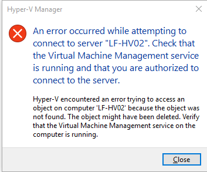

+++
author = "lf"
categories = ["hyper-v", "Windows Server", "PowerShell", "Server 2019"]
date = 2018-08-16T03:25:14Z
description = ""
draft = false
path = "/blog/hyper-v-manager-throws-obscure-errors"
tags = ["hyper-v", "Windows Server", "PowerShell", "Server 2019"]
title = "Hyper-V Manager throws obscure errors if the target computer calls itself something else than you do"

+++

I started testing Server 2019 as a Hyper-V host a few days ago, but getting the GUI manager to connect was a bit challenging. This article will be about as much documentation for me to set this machine up again as it will be instructive. <!-- excerpt -->

This machine is non domain joined.

First, name the computer what you want its final DNS name to be with `Rename-Computer`. Then reboot so you will avoid the issue described in the second half of the post.

Secondly, get a remote shell into it. `Enable-PSRemoting`, and ensure the firewall rules are allowing connections from the subnets you're OK with remote connections from with `Get-NetFirewallRule` piped to `Get-NetFirewallAddressFilter` and `Set-NetFirewallAddressFilter`.

Next, enable CredSSP with `Enable-WSManCredSSP -Role Server` and ensure that the appropriate fresh credential delegation, trusted hosts, and permit-CredSSP GPOs are applied on the client. Check also that the WinRM service is running on the client, and if there are still issues with lacking "permission to complete this task" while connecting with the manager, also run `Enable-WSManCredSSP` with the client role, delegating to the appropriate host.

Then, hopefully, the Hyper-V manager will just connect.

--------------

Now, for the problem I had, and as many details as feasible so the next person Googling for it will find this post.

The error that appeared was:

> "Hyper-V encountered an error trying to access an object on computer 'LF-HV02' because the object was not found. The object might have been deleted. Verify that the Virtual Machine Management service on the computer is running".



I then investigated the event logs on the target system. `In the WMI-Activity/Operational` log, I found an error with event ID 5858, and result code `0x80041002`:

```Id = {8FA5E5DB-34E0-0001-31E6-A58FE034D401}; ClientMachine = WIN-QKHK3OGNV1V; User = WIN-QKHK3OGNV1V\Administrator; ClientProcessId = 2532; Component = Unknown; Operation = Start IWbemServices::GetObject - root\virtualization\v2 : Msvm_VirtualSystemManagementService.CreationClassName="Msvm_VirtualSystemManagementService",Name="vmms",SystemCreationClassName="Msvm_ComputerSystem",SystemName="LF-HV02"; ResultCode = 0x80041002; PossibleCause = Unknown```


When poking around at the mentioned CIM object with `Get-CimInstance -ClassName 'Msvm_VirtualSystemManagementService' -Namespace 'root\virtualization\v2'`, I found that the system name was some randomized name starting with `WIN-`. So, I renamed it to what it was supposed to be called with `Rename-Computer`, rebooted, and that fixed the issue.

