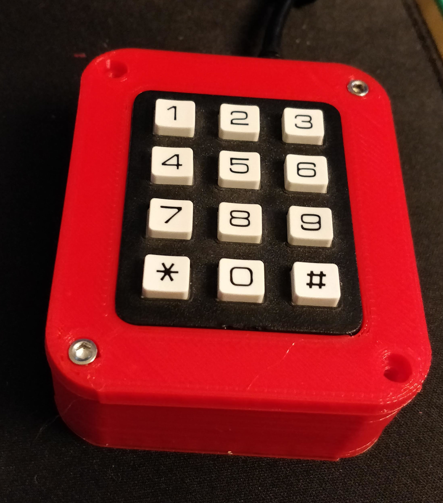
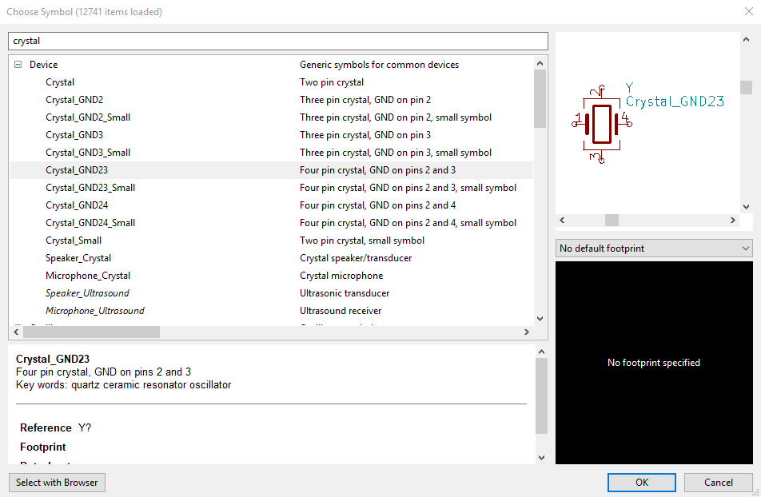
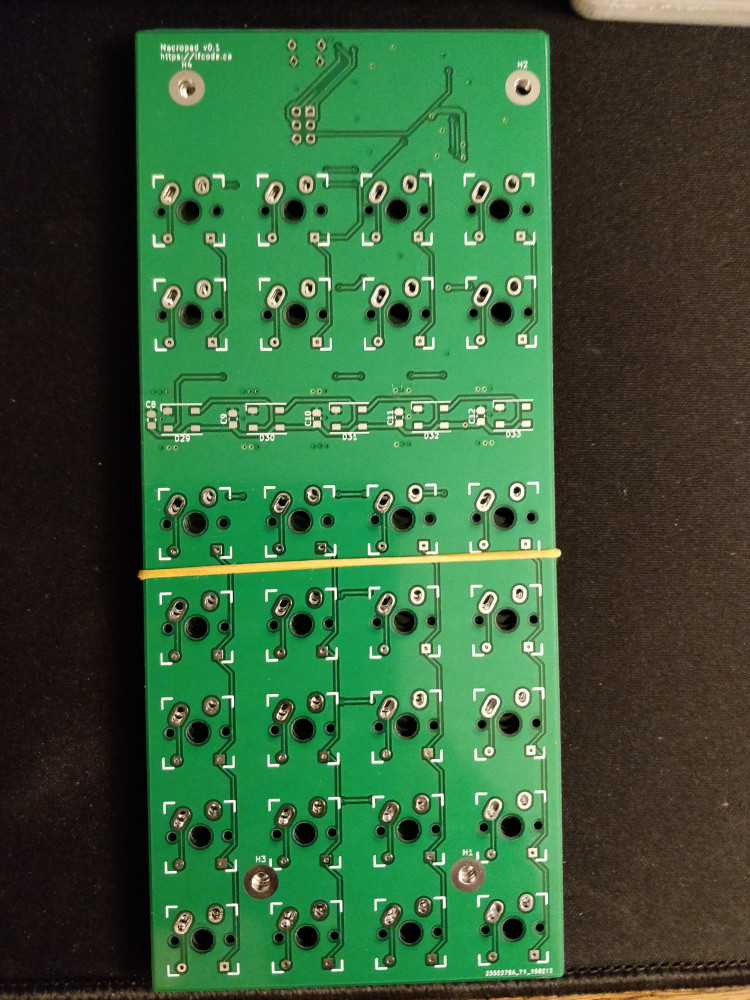
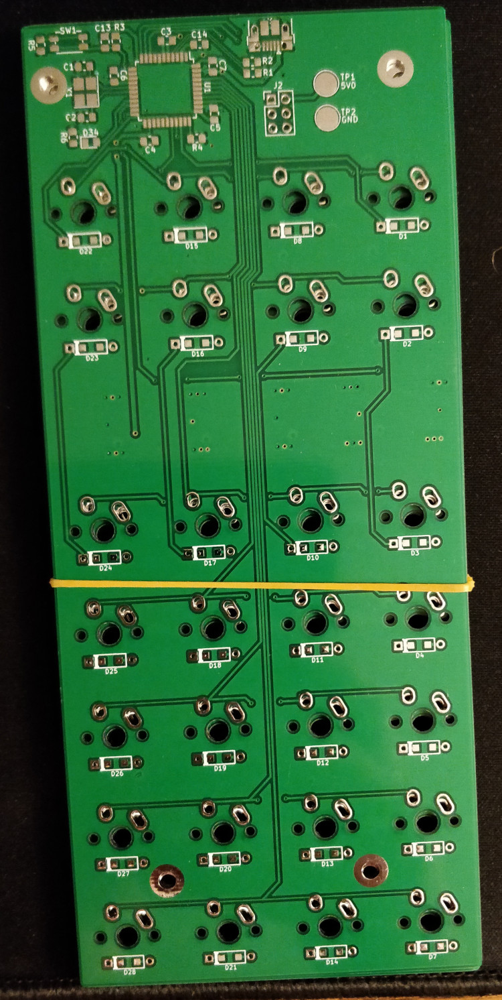

+++
author = "lf"
categories = ["electronics", "firmware", "mechanical"]
date = 2019-03-07T07:15:38Z
description = ""
draft = false
image = "/blog/content/images/2019/03/macropad-in-hand-small.jpg"
path = "/blog/i-designed-and-built-a-mechanical-macropad-numpad"
tags = ["electronics", "firmware", "mechanical"]
title = "I designed and built a mechanical macropad/numpad!"
featuredImage = "../images/macropad-in-hand-small-1.jpg"

+++

More images are available at the [imgur gallery documenting this project](https://imgur.com/a/aq9rSBs).

I built a macropad based on an Arduino Leonardo 2 years ago to rectify my Unicomp Model M keyboard lacking media buttons (volume, media, and others). Around June 2018, I further developed that macropad by adding a 3D printed case for it:
<!-- excerpt -->

It served me well, but it was always frustrating to have keys not always register when pressed, and I wanted to get a Tenkeyless keyboard in order to get more mouse space and place my keyboard more ergonomically.

The obvious solution was to get some sort of mechanical numpad, but my limited research those made it abundantly clear that not only were these difficult to get ahold of in Canada, I probably could not get media buttons with them, somewhat defeating the purpose of getting one. Plus, I wanted an excuse to do some electronics.

I came up with the following design requirements:
- Must have a layer indication on the front
- Should have a numpad layout in case I want to use it as one
- Must have keys outside of the numpad to toggle between modes and provide other functionality
- Should have mechanical switches because it is not worth doing anything less

This led me to use a block of 4x5 keys and a smaller block of 4x2 keys. I knew that addressable LEDs such as the WS2812B or the SK6812 were a good solution to layer indication at the front, requiring less layout work than installing a multiplexer and several single colour LEDs, and providing a good visual indication of layer state with a single glance. These can be used in the future for displaying some sort of system state of the connected computer.

I chose to use plate mount Cherry MX Black switches in this project. For context, many mechanical keyboards are designed such that the keyswitches clip into a plate, and the circuit board is subsequently inserted onto them from the back. An alternative to these is PCB mount switches which rely on the circuit board for mechanical stability, producing less rigid action but avoiding the cost of a plate. I was building a case anyway, so plate mount was the obvious choice.

### Design phase

I began by designing the PCB in KiCad based partially on [this guide](https://github.com/ruiqimao/keyboard-pcb-guide) on GitHub, and I found [this blog post on switch matrices](http://blog.komar.be/how-to-make-a-keyboard-the-matrix/) very helpful for understanding how the diode arrangement works with the keyswitches and how to draw it.

There are a few comments to be made about that guide: it isn't updated to KiCad 5.x, and the built in KiCad libraries have been improved significantly since 4.x, and it uses a crystal symbol which can result in the wrong pinout using the recommended crystal.

The fact that it suggests using custom libraries for crystals and other common components is a practice I cannot recommend based on what I noticed the instant I went digging through the KiCad library while debugging my micro not communicating over the programming interface (more on this later). That is, that there are multiple different pinouts of crystal, and that is abundantly clear based on the descriptions that are there. In contrast, the custom libraries for keyboard parts only have one type of crystal, which hides this error.

While designing the schematic, I found [application note AVR042](http://ww1.microchip.com/downloads/en/appnotes/atmel-2521-avr-hardware-design-considerations_applicationnote_avr042.pdf) very helpful for explaining how to design the circuit for the reset circuit, appropriate decoupling and more.

For instance, while reviewing my schematic, some engineers on /r/AskElectronics were unaware of the recommendation to use a resistor in series with the reset switch in order to slow the discharge of the reset capacitor, potentially creating voltage spikes outside of its spec due to the inductance of the reset line.

### Manufacture

I chose JLCPCB for getting my PCBs manufactured because they were at least a third of the cost of the other options I looked at, and promised very impressive turnaround times for that price. In all, I spent C$17 on circuit boards, including shipping such that they took 8 days from order to landing on my doorstep. The PCBs turned out quite nice to my untrained eye:

All components on the board were hand soldered with only slightly less flux than would be used by Louis Rossmann. This was my first project using SMD parts, and I can state unequivocally that 0806 sized parts are more than possible to solder by hand, and 0.8mm TQFP packages are not too bad either. I purchased a T18-S7 well tip in order to drag solder more effectively, which was largely successful, though might work even better with nicer flux.

Magnification was not required for soldering, however it was critical to inspection of the soldering of the microcontroller, which revealed a few solder bridges.

Parts including switches and all electronics were purchased from Digi-Key, who, true to their reputation, had the parts on my doorstep the next day. The bill of materials parts cost is around C$52 with a quantity of 1.

The case and plate was printed in translucent PLA. It could have probably been printed in white and the LEDs would have shown just fine. I designed this case in Fusion 360, which I have over 100 hours of experience with, designing projects such as my team's Skills Canada robotics design (I will write about this as soon as it is not competitively disadvantageous to do so).

### Firmware

This was a bit of a problem stage in development to some degree, in particular getting the ISP programmer to work. These all turned out to be hardware and software issues unrelated to the actual ISP programmer. I dodged a bullet by using Linux regularly, because the symptoms of using avrdude on Windows are identical to the symptoms of the crystal not working or the cable being disconnected, which could have been some horrific debugging.

The programmer in question is a Deek-Robot USBTinyISP obtained from Universal-Solder, which is an online shop based in Yorkton, SK carrying many cheap Chinese development boards for a very minimal premium over buying them on eBay. I'd strongly recommend them if you live in the Prairies, because using them saved me several weeks of wait time.

I chose qmk because it was posted somewhere online that it was better than tmk, and it does the job. Currently this part of the project is developed as a fork of the qmk repository, but I can likely push my keyboard configuration upstream.

There are many strong words that could be said about qmk documentation, but I cannot and will not say any of them until I've submitted pull requests to improve it.

I strongly recommend using the qmk bootloader, because it appears to be the only one which allows you to actually get out of DFU mode on keyboard startup, albeit by pressing a key (please tell me if I'm wrong on this!).

I found out only through a reddit post that there is the `:production` target in the qmk Makefile that allows you to build a full image including the bootloader and the application image which you can flash to the keyboard to bootstrap it. This would be used for example by running `make handwired/mech_macropad:default:production` where `handwired/mech_macropad` is the path under `keyboards/` for the keyboard you want to compile for and `default` is the keymap.

### Learnings

I learned the hard way to check footprints against datasheets and to make sure that there are no unconnected pins which are not intended to be that way in the schematic. This happened when I had the wrong schematic symbol and footprint for my crystal. I'd like to thank the folks at CrashBang Labs for their invaluable help in debugging this issue.

I need to exercise more care in avoiding getting sticky flux into switches. Thankfully, that was learned on the reset switch rather than a keyswitch.

Many of the earlier tracks on the circuit board design were pointlessly thin, and power tracks could be even thicker than they are. I will consider using polygons for both power and ground more aggressively in future designs, as they significantly simplify routing, reduce resistance, and improve EMI characteristics (which I look forward to learning about in Electrical Engineering over the next few years).

### Status

This project works with all designed features, though I need to invent more macros. Currently, I have music playback, volume controls, like/dislike in Google Play Music Desktop Player, and Discord mic mute.

I found a useful trick for these sorts of shortcuts that are not default OS functions is to use modifiers (ctrl, alt, shift) with high F keys (F13-F24 are supported on Windows and Mac, but few keyboards actually implement them, so they will not conflict with any existing shortcuts).

#### Source availability

This project is open source hardware, published under the terms of the TAPR Open Hardware License. The firmware is published under the GNU General Public License v2.

[Firmware](https://github.com/lf-/qmk_firmware)

[Hardware](https://github.com/lf-/reality/tree/master/mechanical-macropad)

Mechanical: I will publish this once I fix some clearance issues around the USB port to avoid requiring a Dremel.

