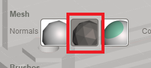
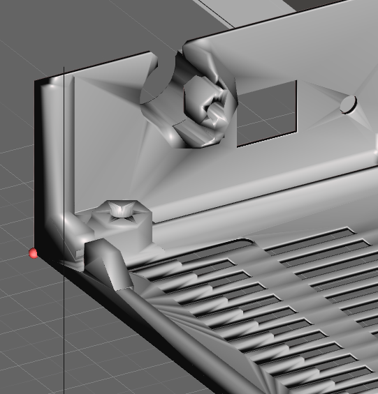
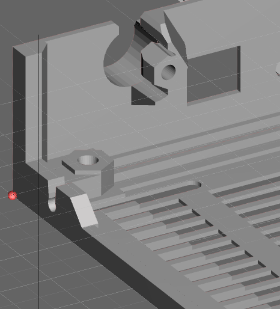

+++
author = "lf"
categories = ["3dprinting", "meshmixer"]
date = 2018-02-19T22:44:34Z
description = ""
draft = false
path = "/blog/make-meshmixer-display-things-usably"
tags = ["3dprinting", "meshmixer"]
title = "Meshmixer: Turn Off Smooth Display"

+++

The default display for meshes in Meshmixer is just a bad idea, especially for people who use it as an STL viewer for technical models.

The setting responsible for this silliness is called "Mesh Normal Mode", which as we all know, should be completely obvious to anyone and everyone. Set that to "Face Normals" and it will display without making the model look like an amorphous blob. Alternately, hold spacebar and select the sphere that has vertices as in the picture below.

### Setting in the "Hotbox"

### Default

### Face Normals

