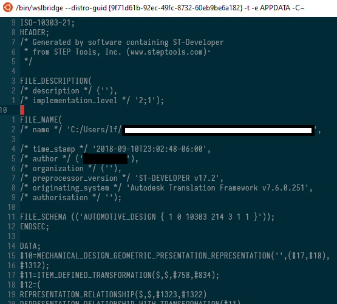

+++
author = "lf"
categories = ["software", "software-politics"]
date = 2019-03-31T01:14:29Z
description = ""
draft = false
path = "/blog/software-should-respect-the-users-privacy-and-inform-them-of-when-an-action-they-are-taking-may-compromise-it"
tags = ["software", "software-politics"]
title = "Software that respects users' privacy must inform them if they are going to compromise it"

+++

Above is a STEP file from Autodesk Fusion 360. It contains personally identifiable information by default: it leaks their Autodesk username (in my case, my full name!) and a file path on the local computer, which could also contain the user's name as well as any other information they might have put in it. In this case, it identifies where a non-scrubbed version of this particular file is found.

Fusion 360 does not tell you that this information is there. It does not display it in the interface either.

This sort of metadata leaking is everywhere. For instance, I have no idea if I can get an email associated with the owner of a Google document if it is shared with me. It's not obvious if it is exposed in the UI, and if it is not, perhaps an API exposes it. This sort of issue is particularly insidious because it makes it easier to use a platform to conduct doxing attacks and makes it unclear whether people whose identities need to remain private can use a service.

Metadata is more interesting than the data itself. This is a central concept in the NSA's phone surveillance: the content of a call can be surmised particularly easily by a computer simply by considering origin, destination and duration.

The primary data in a file is usually completely generated by the user and is very unlikely to contain any PII unless they put it there themselves. Metadata on the other hand is frequently computer generated, is hard to read relative to the data itself, usually hiding in dialogs in dusty corners of the user interface, if exposed at all, and is likely to contain information about the user and their computer.

If you are writing a program which generates files or other information which will be shared, *please* consider what you store as metadata with it. Do not store local paths on the user's computer in the file because they may compromise the user's privacy. *Show* the user what metadata is on the file when they are saving it. Everywhere in the interface where taking some action may reveal information as metadata to someone else, include a small block of text indicating what information that is and why it needs to be collected. Similarly to how [rubber duck debugging](https://en.wikipedia.org/wiki/Rubber_duck_debugging) works, you may notice while you're writing that statement that you don't need to expose some of the information. As much as Apple is a harmful company to the environment and to users' ownership of their devices, I have to commend them on their choice to include a small privacy icon wherever the user is agreeing to provide some information in the provision of a service.

These metadata issues are something which really made me realize how fortunate and privileged I am to be in a situation where having my name published with CAD files is at best annoying. I can think of several people I know online for whom that would be catastrophic, and they are all from groups which have been and continue to be prejudiced against in society. If a team has people from those groups on it, it is far more likely to notice this type of privacy issue and prioritize it appropriately highly.

